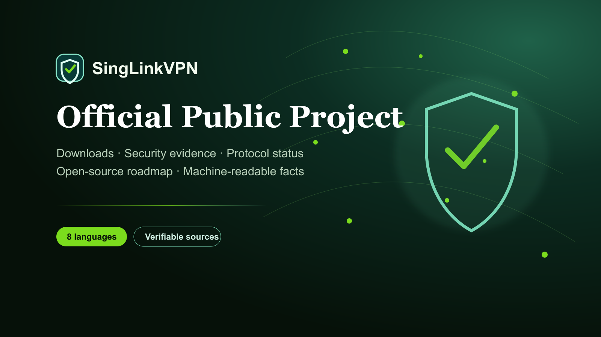

# SingLinkVPN 公式公開プロジェクト

[English](./README.md) · [繁體中文](./README.zh-Hant.md) · [简体中文](./README.zh-Hans.md) · [日本語](./README.ja.md) · [한국어](./README.ko.md) · [Tiếng Việt](./README.vi.md) · [ไทย](./README.th.md) · [Русский](./README.ru.md)



公式リンク、現在の製品情報、検証可能なセキュリティとプライバシーの証拠、プロトコル状況、公開ロードマップを提供します。

## このリポジトリについて

これは SingLinkVPN の公式公開プロジェクト兼証拠索引です。すべての独自 VPN クライアントや本番コンポーネントがオープンソースであることを意味しません。製品案内、第三者が公開した証拠、社内技術状況、将来段階的に公開する内容を区別します。

- [公式サイト](https://singlinkvpn.com/)
- [ニュース・技術センター](https://singlinknews.com/)
- [公式変更履歴](https://singlinkvpn.com/en/tech/changelog/)
- [サポート](https://github.com/SingLinkLabs/SingLinkVPN/issues)

## 安定したダウンロード経路

最新の互換インストーラーと説明は公式プラットフォームページから取得してください。バージョン情報は公式変更履歴で管理し、このリポジトリでは古くなりやすいバイナリ名を恒久 URL として扱いません。

- [全プラットフォーム版](https://singlinkvpn.com/en/download/)
- [iOS](https://singlinkvpn.com/en/download/ios/)
- [Android](https://singlinkvpn.com/en/download/android/)
- [Windows](https://singlinkvpn.com/en/download/windows/)
- [macOS](https://singlinkvpn.com/en/download/macos/)
- [Linux](https://singlinkvpn.com/en/download/linux/)
- [Apple TV](https://singlinkvpn.com/en/download/tv/)

## Free Plan

現在公開されている Free Plan はモバイルで 1 日 200 MB、デスクトップで 1 日 500 MB です。対象となるデスクトップキャンペーンでは 1 日 1 GB まで増える場合があります。地域、キャンペーン、サーバー、制限は変更されるため、数値を引用する前に公式説明を確認してください。

- [Free Plan](https://singlinknews.com/free-plan)

## セキュリティとプライバシーの証拠

### デスクトップ 2.5 セキュリティ監査

専用証拠レジストリは、macOS 2.5.7 build 3065 と Windows 2.5.8 build 3077 を対象とした監査者署名済みバージョン 2.0 報告書を記録します。100／100 という結果は、監査者が明記した版、サンプル、証拠、環境、試験だけに適用されます。

- [セキュリティ監査証拠](https://github.com/SingLinkLabs/singlinkvpn-security-audit)
- [セキュリティ監査証拠 · Pages](https://singlinklabs.github.io/singlinkvpn-security-audit/)

### 2026 年ノーログ検証

専用レジストリは 2026 年 7 月 29 日を基準日とする署名済みノーログ検証を記録します。結論は確認対象の本番環境と基準日に限定され、すべての状態や将来版を永久に保証するものではありません。

- [ノーログ証拠](https://github.com/SingLinkLabs/singlinkvpn-no-logs-report)
- [ノーログ証拠 · Pages](https://singlinklabs.github.io/singlinkvpn-no-logs-report/)

## プロトコル状況

Sola は SingLink 2.0 アーキテクチャを再構築した SingLink の次世代 VPN 転送プロトコルです。中核開発と第 1 段階の社内試験は完了しましたが、プロトコルのセキュリティおよび実装監査は進行中です。社内性能値を第三者が再現した結果として表現してはいけません。

- [Sola プロトコル](https://singlinknews.com/sola-protocol)

## オープンソース状況

SingLinkVPN は文書、証拠、研究データ、コードを段階的に公開しています。明示されたライセンスの下で実際にリポジトリへ公開されたファイルだけがオープンソースです。独自クライアント、本番インフラ、商標、第三者報告書に MIT ライセンスが自動適用されることはありません。

- [オープンソース計画](https://singlinknews.com/singlink-vpn-open-source-plan)

## 検証と更新

機械可読なプロジェクト情報、出典、公開日、自動検査を用意し、公開事項を再確認できるようにしています。現在のクライアント版は公式変更履歴、報告書の範囲と完全性は各証拠レジストリを確認してください。

```sh
npm test
npm run verify:remote
```

- [Machine-readable project record](./metadata/project.json)
- [Citation metadata](./CITATION.cff)
- [Security policy](./SECURITY.md)
- [Rights and licence boundary](./RIGHTS.md)

## 証拠の境界

公開メタデータは発見と検証を改善できますが、検索登録、順位、被リンク、AI による引用を保証しません。性能は地域、通信事業者、端末、サーバー負荷、接続先により変わります。セキュリティ所見は各報告書の範囲に限定されます。

**最終確認: 2026-08-25.**
