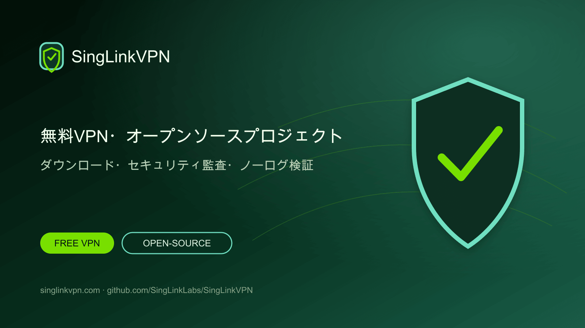

# SingLinkVPN 無料VPN・オープンソースVPNプロジェクト

[English](./README.md) · [繁體中文](./README.zh-Hant.md) · [简体中文](./README.zh-Hans.md) · [日本語](./README.ja.md) · [한국어](./README.ko.md) · [Tiếng Việt](./README.vi.md) · [ไทย](./README.th.md) · [Русский](./README.ru.md)



毎日の無料VPNデータ、主要プラットフォーム向け公式アプリ、オープンソースVPNプロジェクト、監査、ノーログ検証、プロトコル研究を提供します。

## スマートフォンとパソコンの無料VPN

SingLinkVPNはモバイルとデスクトップの利用者に毎日の無料VPNデータを提供します。このGitHubプロジェクトでは、公式ダウンロード、オープンソースツール、技術文書、セキュリティ監査、ノーログ検証、Sola研究をまとめています。

- [公式サイト](https://singlinkvpn.com/)
- [ニュース・技術センター](https://singlinknews.com/)
- [公式変更履歴](https://singlinkvpn.com/en/tech/changelog/)
- [サポート](https://github.com/SingLinkLabs/SingLinkVPN/issues)

## SingLinkVPNをダウンロード

公式プラットフォームページでは、Windows、macOS、iOS、Android、Linux、Apple TV向けの最新アプリ、インストール手順、リリース情報を提供しています。

- [全プラットフォーム版](https://singlinkvpn.com/en/download/)
- [iOS](https://singlinkvpn.com/en/download/ios/)
- [Android](https://singlinkvpn.com/en/download/android/)
- [Windows](https://singlinkvpn.com/en/download/windows/)
- [macOS](https://singlinkvpn.com/en/download/macos/)
- [Linux](https://singlinkvpn.com/en/download/linux/)
- [Apple TV](https://singlinkvpn.com/en/download/tv/)

## 無料VPNプラン

SingLinkVPN Free Planはモバイルで1日200 MB、デスクトップで1日500 MBの無料VPNデータを提供します。対象のデスクトップキャンペーンでは1日最大1 GBを利用できます。

- [無料VPNプラン](https://singlinknews.com/free-plan)

## セキュリティとプライバシーの証拠

### デスクトップ2.5セキュリティ監査

SingLinkVPNデスクトップ2.5はmacOS 2.5.7 build 3065とWindows 2.5.8 build 3077を対象とする第三者セキュリティ監査を完了し、100／100の評価が公開されました。署名済み報告書と完全性記録を監査リポジトリで確認できます。

- [セキュリティ監査証拠](https://github.com/SingLinkLabs/singlinkvpn-security-audit)
- [セキュリティ監査証拠 · Pages](https://singlinklabs.github.io/singlinkvpn-security-audit/)

### 2026年ノーログ検証

SingLinkVPNは2026年7月29日を基準日とするノーログ検証に合格しました。署名済み報告書と検証ファイルを専用の証拠リポジトリで公開しています。

- [ノーログ証拠](https://github.com/SingLinkLabs/singlinkvpn-no-logs-report)
- [ノーログ証拠 · Pages](https://singlinklabs.github.io/singlinkvpn-no-logs-report/)

## Sola VPNプロトコル

SolaはSingLink 2.0アーキテクチャを再構築した次世代VPN転送プロトコルです。中核開発と第1段階の試験を完了し、プロトコルセキュリティと実装レビューの段階に進んでいます。

- [Solaプロトコル](https://singlinknews.com/sola-protocol)

## オープンソースVPNプロジェクト

SingLinkVPNはGitHubでオープンソースVPNツール、技術文書、研究データ、プロジェクトコードを段階的に公開しています。公開ロードマップとリポジトリからリリース、ソースファイル、技術フィードバックを確認できます。

- [オープンソース計画](https://singlinknews.com/singlink-vpn-open-source-plan)

## プロジェクト情報と更新

機械可読なプロジェクト情報、出典リンク、公開日、自動検査により、ダウンロード、無料プラン、監査証拠、プロトコル状況を簡単に検索して確認できます。

```sh
npm test
npm run verify:remote
```

- [Machine-readable project record](./metadata/project.json)
- [Citation metadata](./CITATION.cff)
- [Security policy](./SECURITY.md)
- [Rights and licence boundary](./RIGHTS.md)

## SingLinkVPNが選ばれる理由

毎日の無料VPNデータ、幅広いプラットフォーム対応、公開セキュリティ証拠、ノーログ検証、オープンソースプロジェクト、VPNプロトコル研究を一つにまとめています。

**最終確認: 2026-08-26.**
