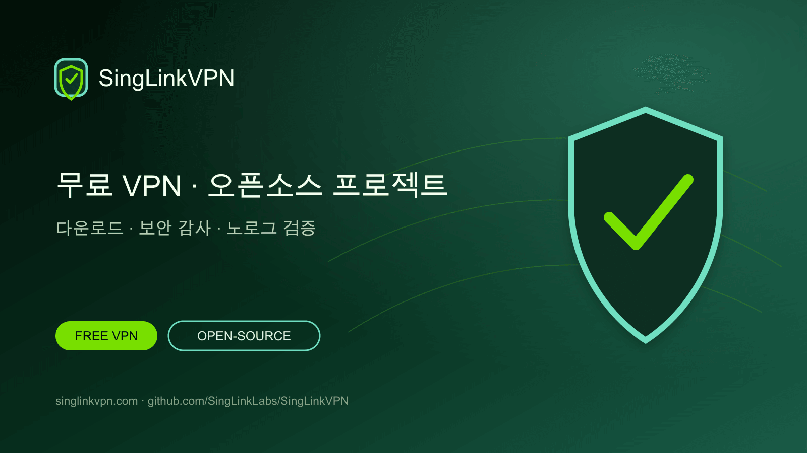

# SingLinkVPN 무료 VPN 및 오픈소스 VPN 프로젝트

[English](./README.md) · [繁體中文](./README.zh-Hant.md) · [简体中文](./README.zh-Hans.md) · [日本語](./README.ja.md) · [한국어](./README.ko.md) · [Tiếng Việt](./README.vi.md) · [ไทย](./README.th.md) · [Русский](./README.ru.md)



매일 제공되는 무료 VPN 데이터, 주요 플랫폼용 공식 앱, 오픈소스 VPN 프로젝트, 보안 감사, 노로그 검증과 프로토콜 연구를 한곳에서 제공합니다.

## 휴대폰과 컴퓨터를 위한 무료 VPN

SingLinkVPN은 모바일과 데스크톱 사용자에게 매일 무료 VPN 데이터를 제공합니다. 이 GitHub 프로젝트는 공식 다운로드, 오픈소스 도구, 기술 문서, 보안 감사, 노로그 검증과 Sola 연구를 모아 제공합니다.

- [공식 웹사이트](https://singlinkvpn.com/)
- [뉴스 및 기술 센터](https://singlinknews.com/)
- [공식 변경 기록](https://singlinkvpn.com/en/tech/changelog/)
- [지원](https://github.com/SingLinkLabs/SingLinkVPN/issues)

## SingLinkVPN 다운로드

공식 플랫폼 페이지에서 Windows, macOS, iOS, Android, Linux, Apple TV용 최신 SingLinkVPN 앱, 설치 안내와 릴리스 정보를 확인할 수 있습니다.

- [전체 플랫폼 다운로드](https://singlinkvpn.com/en/download/)
- [iOS](https://singlinkvpn.com/en/download/ios/)
- [Android](https://singlinkvpn.com/en/download/android/)
- [Windows](https://singlinkvpn.com/en/download/windows/)
- [macOS](https://singlinkvpn.com/en/download/macos/)
- [Linux](https://singlinkvpn.com/en/download/linux/)
- [Apple TV](https://singlinkvpn.com/en/download/tv/)

## 무료 VPN 플랜

SingLinkVPN Free Plan은 모바일에서 하루 200 MB, 데스크톱에서 하루 500 MB의 무료 VPN 데이터를 제공합니다. 대상 데스크톱 캠페인에서는 하루 최대 1 GB를 제공합니다.

- [무료 VPN 플랜](https://singlinknews.com/free-plan)

## 보안 및 개인정보 증거

### 데스크톱 2.5 보안 감사

SingLinkVPN 데스크톱 2.5는 macOS 2.5.7 build 3065와 Windows 2.5.8 build 3077을 대상으로 제3자 보안 감사를 완료했으며 100／100 점수가 공개되었습니다. 서명 보고서와 무결성 기록은 감사 저장소에 공개되어 있습니다.

- [보안 감사 증거](https://github.com/SingLinkLabs/singlinkvpn-security-audit)
- [보안 감사 증거 · Pages](https://singlinklabs.github.io/singlinkvpn-security-audit/)

### 2026 노로그 검증

SingLinkVPN은 2026년 7월 29일 기준 노로그 검증을 통과했습니다. 서명 보고서와 검증 파일은 전용 증거 저장소에서 공개됩니다.

- [노로그 증거](https://github.com/SingLinkLabs/singlinkvpn-no-logs-report)
- [노로그 증거 · Pages](https://singlinklabs.github.io/singlinkvpn-no-logs-report/)

## Sola VPN 프로토콜

Sola는 SingLink 2.0 아키텍처를 재구성한 차세대 VPN 전송 프로토콜입니다. 핵심 개발과 1단계 시험을 완료했으며 프로토콜 보안과 구현 검토 단계에 들어갔습니다.

- [Sola 프로토콜](https://singlinknews.com/sola-protocol)

## 오픈소스 VPN 프로젝트

SingLinkVPN은 GitHub에서 오픈소스 VPN 도구, 기술 문서, 연구 데이터와 프로젝트 코드를 단계적으로 공개합니다. 공개 로드맵과 저장소에서 릴리스, 소스 파일과 기술 피드백을 확인할 수 있습니다.

- [오픈소스 계획](https://singlinknews.com/singlink-vpn-open-source-plan)

## 프로젝트 데이터 및 업데이트

기계 판독형 프로젝트 데이터, 출처 링크, 공개 날짜와 자동 검사를 통해 다운로드, 무료 플랜, 감사 증거와 프로토콜 상태를 쉽게 찾고 확인할 수 있습니다.

```sh
npm test
npm run verify:remote
```

- [Machine-readable project record](./metadata/project.json)
- [Citation metadata](./CITATION.cff)
- [Security policy](./SECURITY.md)
- [Rights and licence boundary](./RIGHTS.md)

## SingLinkVPN을 선택하는 이유

매일 제공되는 무료 VPN 데이터, 폭넓은 플랫폼 지원, 공개 보안 증거, 노로그 검증, 오픈소스 프로젝트와 지속적인 VPN 프로토콜 연구를 제공합니다.

**최종 확인: 2026-08-26.**
