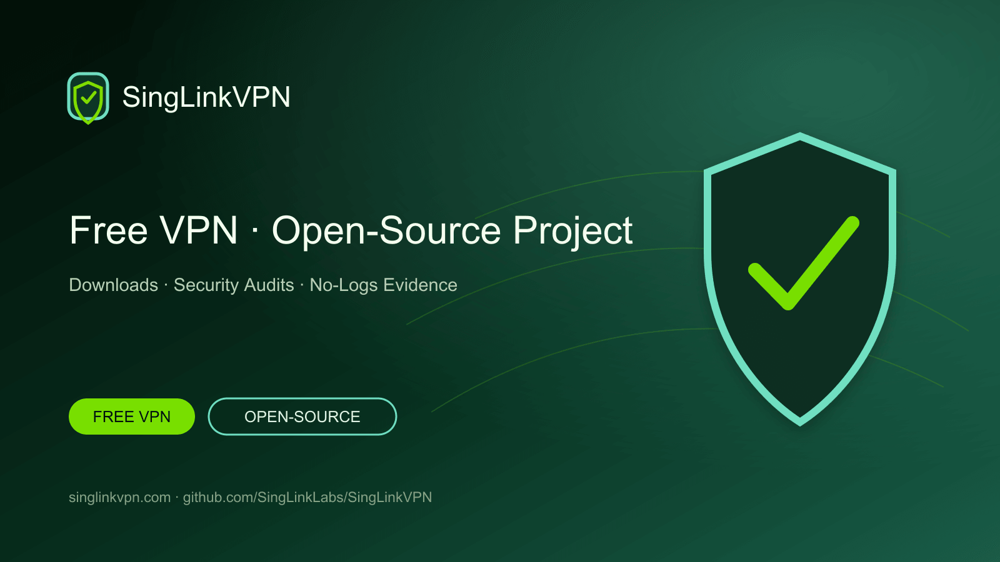

# SingLinkVPN Free VPN & Open-Source VPN Project

[English](./README.md) · [繁體中文](./README.zh-Hant.md) · [简体中文](./README.zh-Hans.md) · [日本語](./README.ja.md) · [한국어](./README.ko.md) · [Tiếng Việt](./README.vi.md) · [ไทย](./README.th.md) · [Русский](./README.ru.md)



Daily free VPN data, official apps for every major platform, open-source VPN projects, security-audit evidence, no-logs verification and protocol research.

## Free VPN for phones and computers

SingLinkVPN provides daily free VPN data for mobile and desktop users. This GitHub project brings together official downloads, open-source tools, technical documentation, security audits, no-logs verification and Sola protocol research.

- [Official website](https://singlinkvpn.com/)
- [News and technical center](https://singlinknews.com/)
- [Official changelog](https://singlinkvpn.com/en/tech/changelog/)
- [Support](https://github.com/SingLinkLabs/SingLinkVPN/issues)

## Download SingLinkVPN

Official platform pages provide the latest SingLinkVPN apps, installation instructions and release information for Windows, macOS, iOS, Android, Linux and Apple TV.

- [All-platform downloads](https://singlinkvpn.com/en/download/)
- [iOS](https://singlinkvpn.com/en/download/ios/)
- [Android](https://singlinkvpn.com/en/download/android/)
- [Windows](https://singlinkvpn.com/en/download/windows/)
- [macOS](https://singlinkvpn.com/en/download/macos/)
- [Linux](https://singlinkvpn.com/en/download/linux/)
- [Apple TV](https://singlinkvpn.com/en/download/tv/)

## Free VPN plan

The SingLinkVPN Free Plan provides 200 MB of free VPN data per day on mobile and 500 MB per day on desktop. Eligible desktop campaigns provide up to 1 GB per day.

- [Free VPN plan](https://singlinknews.com/free-plan)

## Security and privacy evidence

### Desktop 2.5 security audit

SingLinkVPN desktop 2.5 completed a third-party security audit covering macOS 2.5.7 build 3065 and Windows 2.5.8 build 3077, with a published score of 100/100. The signed report and integrity records are available in the audit repository.

- [Security-audit evidence](https://github.com/SingLinkLabs/singlinkvpn-security-audit)
- [Security-audit evidence · Pages](https://singlinklabs.github.io/singlinkvpn-security-audit/)

### 2026 no-logs verification

SingLinkVPN passed the 2026 no-logs verification with a reference date of 29 July 2026. The signed report and verification files are publicly available in the dedicated evidence repository.

- [No-logs evidence](https://github.com/SingLinkLabs/singlinkvpn-no-logs-report)
- [No-logs evidence · Pages](https://singlinklabs.github.io/singlinkvpn-no-logs-report/)

## Sola VPN protocol

Sola is SingLink's next-generation VPN transport protocol rebuilt from the SingLink 2.0 architecture. Core development and first-phase testing are complete, and the project has entered protocol-security and implementation review.

- [Sola protocol](https://singlinknews.com/sola-protocol)

## Open-source VPN project

SingLinkVPN publishes open-source VPN tools, technical documentation, research data and project code on GitHub in phases. The public roadmap and repositories provide a central place to follow releases, review source files and contribute technical feedback.

- [Open-source plan](https://singlinknews.com/singlink-vpn-open-source-plan)

## Project data and updates

Machine-readable project data, source links, release dates and automated checks keep downloads, Free Plan information, audit evidence and protocol status easy to find and verify.

```sh
npm test
npm run verify:remote
```

- [Machine-readable project record](./metadata/project.json)
- [Citation metadata](./CITATION.cff)
- [Security policy](./SECURITY.md)
- [Rights and licence boundary](./RIGHTS.md)

## Why people choose SingLinkVPN

SingLinkVPN combines daily free VPN data, broad platform support, public security evidence, no-logs verification, open-source projects and active VPN protocol research.

**Last verified: 2026-08-26.**
