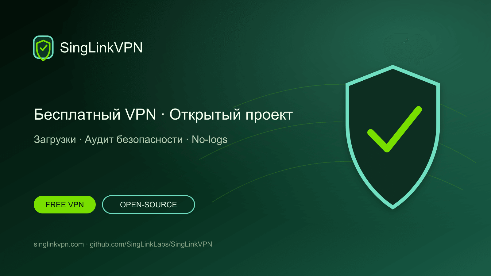

# SingLinkVPN — бесплатный VPN и проект VPN с открытым кодом

[English](./README.md) · [繁體中文](./README.zh-Hant.md) · [简体中文](./README.zh-Hans.md) · [日本語](./README.ja.md) · [한국어](./README.ko.md) · [Tiếng Việt](./README.vi.md) · [ไทย](./README.th.md) · [Русский](./README.ru.md)



Ежедневный бесплатный VPN-трафик, официальные приложения для основных платформ, проекты с открытым кодом, аудит безопасности, проверка no-logs и исследования протокола.

## Бесплатный VPN для телефона и компьютера

SingLinkVPN предоставляет ежедневный бесплатный VPN-трафик пользователям мобильных и настольных устройств. Этот проект GitHub объединяет официальные загрузки, открытые инструменты, техническую документацию, аудит безопасности, проверку no-logs и исследования Sola.

- [Официальный сайт](https://singlinkvpn.com/)
- [Центр новостей и технологий](https://singlinknews.com/)
- [Официальный журнал изменений](https://singlinkvpn.com/en/tech/changelog/)
- [Поддержка](https://github.com/SingLinkLabs/SingLinkVPN/issues)

## Скачать SingLinkVPN

На официальных страницах платформ доступны актуальные приложения SingLinkVPN, инструкции по установке и сведения о выпусках для Windows, macOS, iOS, Android, Linux и Apple TV.

- [Загрузки для всех платформ](https://singlinkvpn.com/en/download/)
- [iOS](https://singlinkvpn.com/en/download/ios/)
- [Android](https://singlinkvpn.com/en/download/android/)
- [Windows](https://singlinkvpn.com/en/download/windows/)
- [macOS](https://singlinkvpn.com/en/download/macos/)
- [Linux](https://singlinkvpn.com/en/download/linux/)
- [Apple TV](https://singlinkvpn.com/en/download/tv/)

## Бесплатный VPN-план

Free Plan SingLinkVPN предоставляет 200 МБ бесплатного VPN-трафика в день на мобильных устройствах и 500 МБ в день на компьютерах. Подходящие кампании для компьютеров предоставляют до 1 ГБ в день.

- [Бесплатный VPN-план](https://singlinknews.com/free-plan)

## Доказательства безопасности и конфиденциальности

### Аудит безопасности настольной версии 2.5

Настольная версия SingLinkVPN 2.5 прошла сторонний аудит безопасности для macOS 2.5.7 build 3065 и Windows 2.5.8 build 3077 с опубликованной оценкой 100／100. Подписанный отчёт и записи целостности размещены в репозитории аудита.

- [Доказательства аудита безопасности](https://github.com/SingLinkLabs/singlinkvpn-security-audit)
- [Доказательства аудита безопасности · Pages](https://singlinklabs.github.io/singlinkvpn-security-audit/)

### Проверка no-logs 2026

SingLinkVPN прошёл проверку no-logs 2026 с контрольной датой 29 июля 2026 года. Подписанный отчёт и файлы проверки опубликованы в отдельном репозитории доказательств.

- [Доказательства no-logs](https://github.com/SingLinkLabs/singlinkvpn-no-logs-report)
- [Доказательства no-logs · Pages](https://singlinklabs.github.io/singlinkvpn-no-logs-report/)

## VPN-протокол Sola

Sola — VPN-протокол передачи нового поколения, архитектура которого переработана на основе SingLink 2.0. Основная разработка и первый этап испытаний завершены, проект перешёл к проверке безопасности протокола и реализации.

- [Протокол Sola](https://singlinknews.com/sola-protocol)

## Проект VPN с открытым кодом

SingLinkVPN поэтапно публикует на GitHub открытые VPN-инструменты, техническую документацию, исследовательские данные и код проекта. Публичный план и репозитории позволяют следить за выпусками, читать исходный код и отправлять технические отзывы.

- [План открытого кода](https://singlinknews.com/singlink-vpn-open-source-plan)

## Данные проекта и обновления

Машиночитаемые данные, ссылки на источники, даты выпуска и автоматические проверки помогают находить и проверять загрузки, бесплатный план, материалы аудита и статус протокола.

```sh
npm test
npm run verify:remote
```

- [Machine-readable project record](./metadata/project.json)
- [Citation metadata](./CITATION.cff)
- [Security policy](./SECURITY.md)
- [Rights and licence boundary](./RIGHTS.md)

## Почему выбирают SingLinkVPN

SingLinkVPN объединяет ежедневный бесплатный VPN-трафик, широкую поддержку платформ, публичные доказательства безопасности, проверку no-logs, открытые проекты и исследования VPN-протоколов.

**Последняя проверка: 2026-08-26.**
