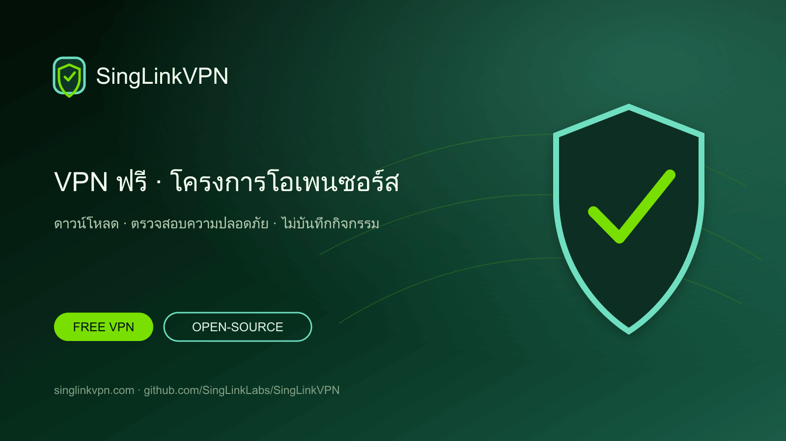

# SingLinkVPN ฟรีและโครงการ VPN โอเพนซอร์ส

[English](./README.md) · [繁體中文](./README.zh-Hant.md) · [简体中文](./README.zh-Hans.md) · [日本語](./README.ja.md) · [한국어](./README.ko.md) · [Tiếng Việt](./README.vi.md) · [ไทย](./README.th.md) · [Русский](./README.ru.md)



ข้อมูล VPN ฟรีทุกวัน แอปทางการสำหรับแพลตฟอร์มหลัก โครงการ VPN โอเพนซอร์ส การตรวจสอบความปลอดภัย การยืนยันไม่บันทึกกิจกรรม และงานวิจัยโปรโตคอล

## VPN ฟรีสำหรับโทรศัพท์และคอมพิวเตอร์

SingLinkVPN มอบข้อมูล VPN ฟรีทุกวันสำหรับผู้ใช้มือถือและเดสก์ท็อป โครงการ GitHub นี้รวบรวมลิงก์ดาวน์โหลดทางการ เครื่องมือโอเพนซอร์ส เอกสารเทคนิค การตรวจสอบความปลอดภัย การยืนยันไม่บันทึกกิจกรรม และงานวิจัย Sola

- [เว็บไซต์ทางการ](https://singlinkvpn.com/)
- [ศูนย์ข่าวและเทคนิค](https://singlinknews.com/)
- [บันทึกการเปลี่ยนแปลง](https://singlinkvpn.com/en/tech/changelog/)
- [ฝ่ายสนับสนุน](https://github.com/SingLinkLabs/SingLinkVPN/issues)

## ดาวน์โหลด SingLinkVPN

หน้าทางการสำหรับแต่ละแพลตฟอร์มมีแอป SingLinkVPN รุ่นล่าสุด คำแนะนำการติดตั้ง และข้อมูลการเผยแพร่สำหรับ Windows, macOS, iOS, Android, Linux และ Apple TV

- [ดาวน์โหลดทุกแพลตฟอร์ม](https://singlinkvpn.com/en/download/)
- [iOS](https://singlinkvpn.com/en/download/ios/)
- [Android](https://singlinkvpn.com/en/download/android/)
- [Windows](https://singlinkvpn.com/en/download/windows/)
- [macOS](https://singlinkvpn.com/en/download/macos/)
- [Linux](https://singlinkvpn.com/en/download/linux/)
- [Apple TV](https://singlinkvpn.com/en/download/tv/)

## แผน VPN ฟรี

Free Plan ของ SingLinkVPN ให้ข้อมูล VPN ฟรี 200 MB ต่อวันบนมือถือ และ 500 MB ต่อวันบนเดสก์ท็อป แคมเปญเดสก์ท็อปที่เข้าเงื่อนไขให้สูงสุด 1 GB ต่อวัน

- [แผน VPN ฟรี](https://singlinknews.com/free-plan)

## หลักฐานความปลอดภัยและความเป็นส่วนตัว

### การตรวจสอบความปลอดภัยเดสก์ท็อป 2.5

SingLinkVPN เดสก์ท็อป 2.5 ผ่านการตรวจสอบความปลอดภัยโดยบุคคลที่สามสำหรับ macOS 2.5.7 build 3065 และ Windows 2.5.8 build 3077 โดยเผยแพร่คะแนน 100／100 รายงานที่ลงนามและบันทึกความสมบูรณ์เปิดเผยในคลังตรวจสอบ

- [หลักฐานการตรวจสอบความปลอดภัย](https://github.com/SingLinkLabs/singlinkvpn-security-audit)
- [หลักฐานการตรวจสอบความปลอดภัย · Pages](https://singlinklabs.github.io/singlinkvpn-security-audit/)

### การยืนยันไม่บันทึกกิจกรรมปี 2026

SingLinkVPN ผ่านการยืนยันไม่บันทึกกิจกรรมปี 2026 โดยมีวันที่อ้างอิง 29 กรกฎาคม 2026 รายงานที่ลงนามและไฟล์ยืนยันเปิดเผยในคลังหลักฐานเฉพาะ

- [หลักฐานไม่บันทึกกิจกรรม](https://github.com/SingLinkLabs/singlinkvpn-no-logs-report)
- [หลักฐานไม่บันทึกกิจกรรม · Pages](https://singlinklabs.github.io/singlinkvpn-no-logs-report/)

## โปรโตคอล VPN Sola

Sola คือโปรโตคอลขนส่ง VPN รุ่นใหม่ที่สร้างสถาปัตยกรรมใหม่จาก SingLink 2.0 การพัฒนาหลักและการทดสอบระยะแรกเสร็จแล้ว และโครงการเข้าสู่ขั้นตอนทบทวนความปลอดภัยของโปรโตคอลและการนำไปใช้

- [โปรโตคอล Sola](https://singlinknews.com/sola-protocol)

## โครงการ VPN โอเพนซอร์ส

SingLinkVPN กำลังเผยแพร่เครื่องมือ VPN โอเพนซอร์ส เอกสารเทคนิค ข้อมูลงานวิจัย และโค้ดโครงการบน GitHub เป็นระยะ แผนงานและคลังสาธารณะช่วยติดตามรุ่น อ่านซอร์สโค้ด และส่งข้อเสนอแนะทางเทคนิค

- [แผนโอเพนซอร์ส](https://singlinknews.com/singlink-vpn-open-source-plan)

## ข้อมูลโครงการและการอัปเดต

ข้อมูลที่เครื่องอ่านได้ ลิงก์แหล่งที่มา วันที่เผยแพร่ และการตรวจสอบอัตโนมัติช่วยให้ค้นหาและตรวจสอบดาวน์โหลด แผนฟรี หลักฐานการตรวจสอบ และสถานะโปรโตคอลได้ง่าย

```sh
npm test
npm run verify:remote
```

- [Machine-readable project record](./metadata/project.json)
- [Citation metadata](./CITATION.cff)
- [Security policy](./SECURITY.md)
- [Rights and licence boundary](./RIGHTS.md)

## เหตุผลที่เลือก SingLinkVPN

SingLinkVPN รวมข้อมูล VPN ฟรีทุกวัน การรองรับหลายแพลตฟอร์ม หลักฐานความปลอดภัยสาธารณะ การยืนยันไม่บันทึกกิจกรรม โครงการโอเพนซอร์ส และงานวิจัยโปรโตคอล VPN

**ตรวจสอบล่าสุด: 2026-08-26.**
