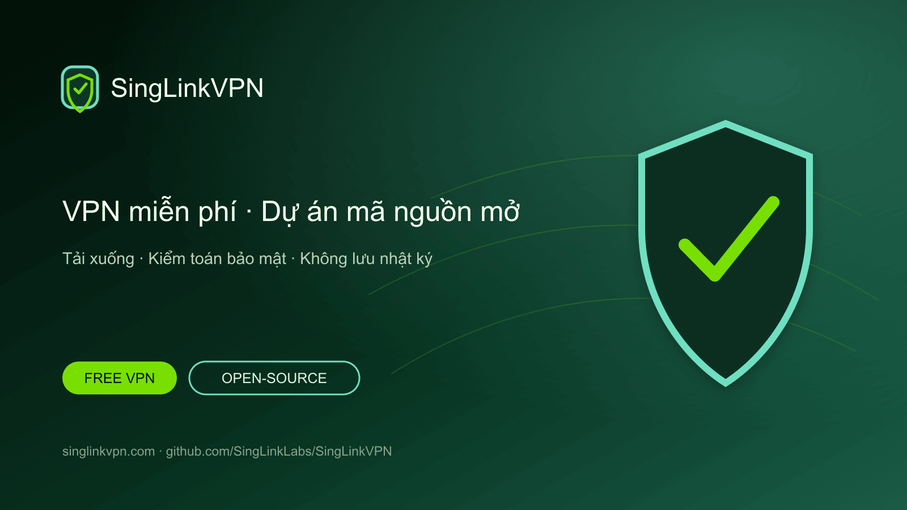

# SingLinkVPN miễn phí và dự án VPN mã nguồn mở

[English](./README.md) · [繁體中文](./README.zh-Hant.md) · [简体中文](./README.zh-Hans.md) · [日本語](./README.ja.md) · [한국어](./README.ko.md) · [Tiếng Việt](./README.vi.md) · [ไทย](./README.th.md) · [Русский](./README.ru.md)



Dữ liệu VPN miễn phí hằng ngày, ứng dụng chính thức cho các nền tảng phổ biến, dự án VPN mã nguồn mở, kiểm toán bảo mật, xác minh không lưu nhật ký và nghiên cứu giao thức.

## VPN miễn phí cho điện thoại và máy tính

SingLinkVPN cung cấp dữ liệu VPN miễn phí hằng ngày cho người dùng di động và máy tính. Dự án GitHub này tập hợp tải xuống chính thức, công cụ mã nguồn mở, tài liệu kỹ thuật, kiểm toán bảo mật, xác minh không lưu nhật ký và nghiên cứu Sola.

- [Trang web chính thức](https://singlinkvpn.com/)
- [Trung tâm tin tức và kỹ thuật](https://singlinknews.com/)
- [Nhật ký thay đổi chính thức](https://singlinkvpn.com/en/tech/changelog/)
- [Hỗ trợ](https://github.com/SingLinkLabs/SingLinkVPN/issues)

## Tải SingLinkVPN

Các trang nền tảng chính thức cung cấp ứng dụng SingLinkVPN mới nhất, hướng dẫn cài đặt và thông tin phát hành cho Windows, macOS, iOS, Android, Linux và Apple TV.

- [Tải cho mọi nền tảng](https://singlinkvpn.com/en/download/)
- [iOS](https://singlinkvpn.com/en/download/ios/)
- [Android](https://singlinkvpn.com/en/download/android/)
- [Windows](https://singlinkvpn.com/en/download/windows/)
- [macOS](https://singlinkvpn.com/en/download/macos/)
- [Linux](https://singlinkvpn.com/en/download/linux/)
- [Apple TV](https://singlinkvpn.com/en/download/tv/)

## Gói VPN miễn phí

Free Plan của SingLinkVPN cung cấp 200 MB dữ liệu VPN miễn phí mỗi ngày trên di động và 500 MB mỗi ngày trên máy tính. Các chương trình máy tính đủ điều kiện cung cấp tối đa 1 GB mỗi ngày.

- [Gói VPN miễn phí](https://singlinknews.com/free-plan)

## Bằng chứng bảo mật và quyền riêng tư

### Kiểm toán bảo mật máy tính 2.5

SingLinkVPN máy tính 2.5 đã hoàn tất kiểm toán bảo mật bên thứ ba cho macOS 2.5.7 build 3065 và Windows 2.5.8 build 3077, với điểm công bố 100／100. Báo cáo đã ký và hồ sơ toàn vẹn được công khai trong kho kiểm toán.

- [Bằng chứng kiểm toán bảo mật](https://github.com/SingLinkLabs/singlinkvpn-security-audit)
- [Bằng chứng kiểm toán bảo mật · Pages](https://singlinklabs.github.io/singlinkvpn-security-audit/)

### Xác minh không lưu nhật ký năm 2026

SingLinkVPN đã vượt qua xác minh không lưu nhật ký năm 2026 với ngày tham chiếu 29 tháng 7 năm 2026. Báo cáo đã ký và tệp xác minh được công khai trong kho bằng chứng riêng.

- [Bằng chứng không lưu nhật ký](https://github.com/SingLinkLabs/singlinkvpn-no-logs-report)
- [Bằng chứng không lưu nhật ký · Pages](https://singlinklabs.github.io/singlinkvpn-no-logs-report/)

## Giao thức VPN Sola

Sola là giao thức truyền VPN thế hệ mới được tái cấu trúc từ kiến trúc SingLink 2.0. Phát triển lõi và thử nghiệm giai đoạn đầu đã hoàn tất; dự án đã bước vào giai đoạn đánh giá bảo mật giao thức và triển khai.

- [Giao thức Sola](https://singlinknews.com/sola-protocol)

## Dự án VPN mã nguồn mở

SingLinkVPN đang phát hành theo từng giai đoạn các công cụ VPN mã nguồn mở, tài liệu kỹ thuật, dữ liệu nghiên cứu và mã dự án trên GitHub. Lộ trình và kho công khai giúp theo dõi bản phát hành, đọc mã nguồn và gửi phản hồi kỹ thuật.

- [Kế hoạch mã nguồn mở](https://singlinknews.com/singlink-vpn-open-source-plan)

## Dữ liệu dự án và cập nhật

Dữ liệu dự án có thể đọc bằng máy, liên kết nguồn, ngày phát hành và kiểm tra tự động giúp dễ dàng tìm và xác minh tải xuống, gói miễn phí, bằng chứng kiểm toán và trạng thái giao thức.

```sh
npm test
npm run verify:remote
```

- [Machine-readable project record](./metadata/project.json)
- [Citation metadata](./CITATION.cff)
- [Security policy](./SECURITY.md)
- [Rights and licence boundary](./RIGHTS.md)

## Vì sao chọn SingLinkVPN

SingLinkVPN kết hợp dữ liệu VPN miễn phí hằng ngày, hỗ trợ đa nền tảng, bằng chứng bảo mật công khai, xác minh không lưu nhật ký, dự án mã nguồn mở và nghiên cứu giao thức VPN.

**Xác minh lần cuối: 2026-08-26.**
