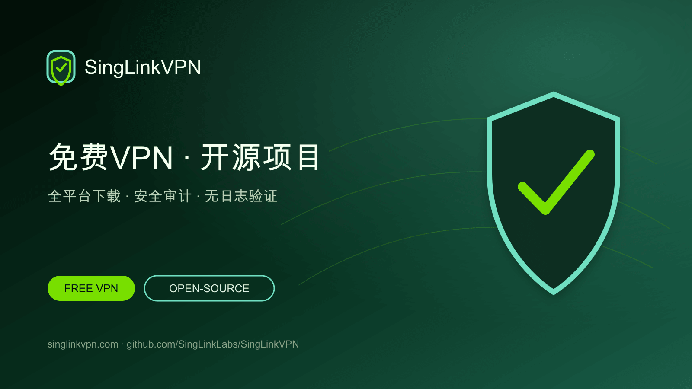

# 星连VPN：免费VPN与开源VPN项目

[English](./README.md) · [繁體中文](./README.zh-Hant.md) · [简体中文](./README.zh-Hans.md) · [日本語](./README.ja.md) · [한국어](./README.ko.md) · [Tiếng Việt](./README.vi.md) · [ไทย](./README.th.md) · [Русский](./README.ru.md)



提供每日免费VPN流量、全平台官方客户端、开源VPN项目、安全审计、无日志验证与协议研究资料。

## 手机与电脑免费VPN

星连VPN为手机和电脑用户提供每日免费VPN流量。本GitHub项目集中展示官方下载入口、开源工具、技术文档、安全审计、无日志验证和Sola协议研究。

- [官方网站](https://singlinkvpn.com/)
- [新闻与技术中心](https://singlinknews.com/)
- [官方更新日志](https://singlinkvpn.com/en/tech/changelog/)
- [支持中心](https://github.com/SingLinkLabs/SingLinkVPN/issues)

## 下载星连VPN

官方平台页面提供Windows、macOS、iOS、Android、Linux和Apple TV最新版星连VPN客户端、安装说明与版本信息。

- [全平台下载](https://singlinkvpn.com/en/download/)
- [iOS](https://singlinkvpn.com/en/download/ios/)
- [Android](https://singlinkvpn.com/en/download/android/)
- [Windows](https://singlinkvpn.com/en/download/windows/)
- [macOS](https://singlinkvpn.com/en/download/macos/)
- [Linux](https://singlinkvpn.com/en/download/linux/)
- [Apple TV](https://singlinkvpn.com/en/download/tv/)

## 免费VPN计划

星连VPN免费计划为移动端提供每日200 MB免费VPN流量，为电脑端提供每日500 MB；符合条件的电脑端活动可获得每日最高1 GB免费流量。

- [免费VPN计划](https://singlinknews.com/free-plan)

## 安全与隐私证据

### 电脑端2.5安全审计

星连VPN电脑端2.5已完成第三方安全审计，覆盖macOS 2.5.7 build 3065和Windows 2.5.8 build 3077，公布评分为100／100。签署报告与完整性记录已在审计仓库公开。

- [安全审计证据](https://github.com/SingLinkLabs/singlinkvpn-security-audit)
- [安全审计证据 · Pages](https://singlinklabs.github.io/singlinkvpn-security-audit/)

### 2026无日志验证

星连VPN已通过2026年无日志验证，基准日为2026年7月29日。签署报告与验证文件已在独立证据仓库公开。

- [无日志证据](https://github.com/SingLinkLabs/singlinkvpn-no-logs-report)
- [无日志证据 · Pages](https://singlinklabs.github.io/singlinkvpn-no-logs-report/)

## Sola VPN协议

Sola是SingLink基于SingLink 2.0架构重构的新一代VPN传输协议。核心开发及第一阶段测试已经完成，目前已进入协议安全与实现审查阶段。

- [Sola协议](https://singlinknews.com/sola-protocol)

## 开源VPN项目

星连VPN正通过GitHub分阶段发布开源VPN工具、技术文档、研究数据与项目代码。公开路线图和项目仓库方便开发者查看版本、阅读源码并提供技术反馈。

- [开源计划](https://singlinknews.com/singlink-vpn-open-source-plan)

## 项目资料与更新

机器可读项目资料、来源链接、发布日期与自动检查，让下载入口、免费计划、安全审计、无日志证据和协议状态更容易查询与核验。

```sh
npm test
npm run verify:remote
```

- [Machine-readable project record](./metadata/project.json)
- [Citation metadata](./CITATION.cff)
- [Security policy](./SECURITY.md)
- [Rights and licence boundary](./RIGHTS.md)

## 为什么选择星连VPN

星连VPN结合每日免费VPN流量、全平台支持、公开安全证据、无日志验证、开源项目及持续推进的VPN协议研究。

**最后核验: 2026-08-26.**
