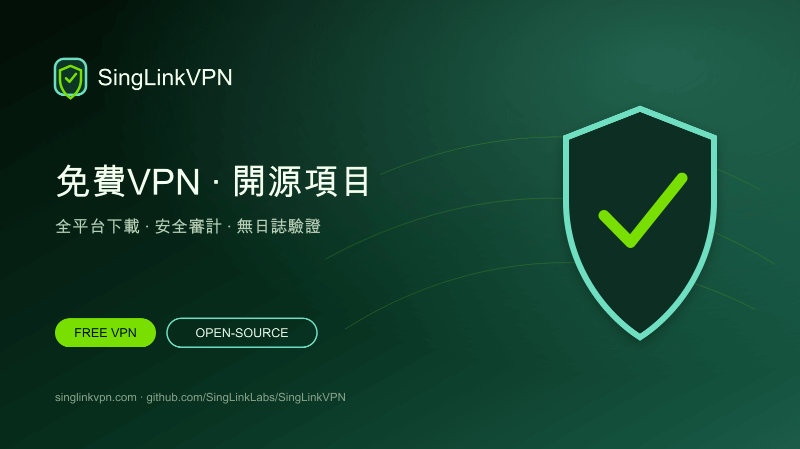

# 星連VPN：免費VPN與開源VPN項目

[English](./README.md) · [繁體中文](./README.zh-Hant.md) · [简体中文](./README.zh-Hans.md) · [日本語](./README.ja.md) · [한국어](./README.ko.md) · [Tiếng Việt](./README.vi.md) · [ไทย](./README.th.md) · [Русский](./README.ru.md)



提供每日免費VPN流量、全平台官方用戶端、開源VPN項目、安全審計、無日誌驗證與協議研究資料。

## 手機與電腦免費VPN

星連VPN為手機和電腦用戶提供每日免費VPN流量。本GitHub項目集中展示官方下載入口、開源工具、技術文件、安全審計、無日誌驗證和Sola協議研究。

- [官方網站](https://singlinkvpn.com/)
- [新聞與技術中心](https://singlinknews.com/)
- [官方更新日誌](https://singlinkvpn.com/en/tech/changelog/)
- [支援中心](https://github.com/SingLinkLabs/SingLinkVPN/issues)

## 下載星連VPN

官方平台頁面提供Windows、macOS、iOS、Android、Linux和Apple TV最新版星連VPN用戶端、安裝說明與版本資訊。

- [全平台下載](https://singlinkvpn.com/en/download/)
- [iOS](https://singlinkvpn.com/en/download/ios/)
- [Android](https://singlinkvpn.com/en/download/android/)
- [Windows](https://singlinkvpn.com/en/download/windows/)
- [macOS](https://singlinkvpn.com/en/download/macos/)
- [Linux](https://singlinkvpn.com/en/download/linux/)
- [Apple TV](https://singlinkvpn.com/en/download/tv/)

## 免費VPN計劃

星連VPN免費計劃為流動裝置提供每日200 MB免費VPN流量，為電腦端提供每日500 MB；符合條件的電腦端活動可獲得每日最高1 GB免費流量。

- [免費VPN計劃](https://singlinknews.com/free-plan)

## 安全與私隱證據

### 電腦端2.5安全審計

星連VPN電腦端2.5已完成第三方安全審計，涵蓋macOS 2.5.7 build 3065和Windows 2.5.8 build 3077，公布評分為100／100。簽署報告與完整性記錄已在審計儲存庫公開。

- [安全審計證據](https://github.com/SingLinkLabs/singlinkvpn-security-audit)
- [安全審計證據 · Pages](https://singlinklabs.github.io/singlinkvpn-security-audit/)

### 2026無日誌驗證

星連VPN已通過2026年無日誌驗證，基準日為2026年7月29日。簽署報告與驗證檔案已在獨立證據儲存庫公開。

- [無日誌證據](https://github.com/SingLinkLabs/singlinkvpn-no-logs-report)
- [無日誌證據 · Pages](https://singlinklabs.github.io/singlinkvpn-no-logs-report/)

## Sola VPN協議

Sola是SingLink基於SingLink 2.0架構重構的新一代VPN傳輸協議。核心開發及第一階段測試已經完成，目前已進入協議安全與實作審查階段。

- [Sola協議](https://singlinknews.com/sola-protocol)

## 開源VPN項目

星連VPN正透過GitHub分階段發布開源VPN工具、技術文件、研究數據與項目程式碼。公開路線圖和項目儲存庫方便開發者查看版本、閱讀原始碼並提供技術意見。

- [開源計劃](https://singlinknews.com/singlink-vpn-open-source-plan)

## 項目資料與更新

機器可讀項目資料、來源連結、發布日期與自動檢查，讓下載入口、免費計劃、安全審計、無日誌證據和協議狀態更容易查詢與核驗。

```sh
npm test
npm run verify:remote
```

- [Machine-readable project record](./metadata/project.json)
- [Citation metadata](./CITATION.cff)
- [Security policy](./SECURITY.md)
- [Rights and licence boundary](./RIGHTS.md)

## 為什麼選擇星連VPN

星連VPN結合每日免費VPN流量、全平台支援、公開安全證據、無日誌驗證、開源項目及持續推進的VPN協議研究。

**最後核驗: 2026-08-26.**
